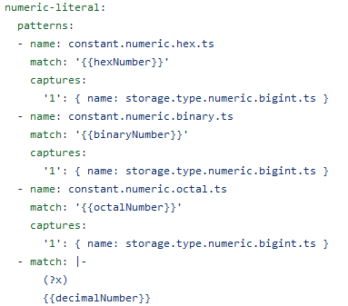

# Особенности реализации системы подсветки синтаксиса в некоторых средах разработки

ИВМО-04-21, Проказин Михаил Руславнович

---

# Об этом выступлении

- Тема: Методы доменно-оринетированной подсветки синтаксиса в средах разработки
- Доменно-ориентированная подсветка синтаксиса = семантическая подсветка синтаксиса + карты семантических доменов + интерфейс для конфигурации
- В ходе работы было в том числе проведено исследование разных реализаций систем подсветки синтаксиса

---

# Что такое подсветка синтаксиса


Без подсветки синтаксиса:
```
def foo(p):
    return p * 40 + "123"
```
С подсветкой синтаксиса
```python
def foo(p):
    return p * 40 + "123"
```

---

# Обзор современных средсв подсветки синтаксиса
- __IDE-специфичные реализации__, на основе SDK самой IDE
    - Примеры: Visual Studio (с языками VB.Net, C# и C++), Jet Brains Intellij IDEA (только Java), Net Beans, и т.д.
- Простые универсальные редакторы кода - __TextMate грамматики__
  Они работают на основе регулярных выражений, подходит для разных языков
    - Примеры: Nano, Micro, neovim, VS Code, Atom, Sublime
- Универсальные редакторы кода с элементами среды разработки - __Language Server Protocol__
  Единый протокол интеграции плагинов для предоставления насыщенной информации о языке
    - Примеры: Visual Studio, IDEA, VS Code с плагинами, Atom с плагинами, и все-все-все
    
---

# TextMate грамматики

- Де-факто стандарт спецификации подсветки синтаксиса в формате JSON и регулярных выражений.
- Регулярные выражения образуют иерархию "областей".

---

# Пример определения TextMate грамматики

Фрагмент определения TextMate грамматики для JavaScript



---

# Пример работы грамматики


На скриншоте видно иерархию областей (scopes) TextMate

---

# Протокол языкового сервера

- Language Server Protocol - открытый стандарт, предлагающий стандартный набор форматов сообщений от среды разработки к другому приложению, называемому языковым сервером.
- Этот API построен на JSON/RPC
- Начался как часть подхода к расширениям Visual Studio Code, но является открытым и бесплатным.
- Перечень видов сообщений соответствует всем основным функциям среды разработки: отладка, подсветка синтаксиса, автодополнение, навигация, и другие.

---

# Как работает протокол языкового сервера

<style>
  div.lsp-how-it-works img { 
    width: 20.3em; 
  }
  div.lsp-how-it-works {
    place-content: center;
  }
</style>

<div class="lsp-how-it-works">


</div>

- Работа с исходным кодом происходит в редакторе.
- Редактор читает и изменяет исходный код.
- Языковой сервер анализирует текст исходного кода
- Языковой сервер, по запросу редактора (клиента), предоставляет данные для подсветки синтаксиса (и множество других).

---

# Что не упомянуто

- История развития подсветки синтаксиса
- Другие технологии подсветки синтаксиса
- Специфика работы языковых серверов
- Особенности API семантических токенов языкового сервера

---

# Особенности реализации системы подсветки синтаксиса в некоторых средах разработки

ИВМО-04-21, Проказин Михаил Руславнович
