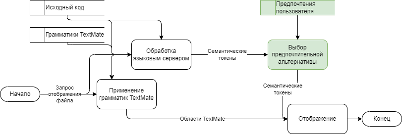

<div class="credentials-wrapper">
<div class="mirea-logo"></div>
<div class="mirea-right-to-logo">
МИНОБРНАУКИ РОССИИ

Федеральное государственное бюджетное образовательное учреждение высшего образования  

«МИРЭА – Российский технологический университет»  

**РТУ МИРЭА
Институт информационных технологий 
Кафедра №250 математического обеспечения информационных систем**
</div>
<div class="mirea-below-logo">
Выпускная квалификационная работа на тему:

# Методы доменно-ориентированной подсветки синтаксиса в интегрированной среде разработки
<div style="text-align: right">

Студент группы ИВМО-04-21 **Проказин Михаил Русланович**
Руководитель **Уманский Станислав Александрович**

<div>
</div>
</div>

--- 

# Цель работы

- Предложить метод реализации доменно-ориентированной системы подсветки синтаксиса

# Задачи работы

- Исследовать реализации систем подсветки синтаксиса в современных средах разработки
- Спроектировать реализацию системы доменно-ориентированной подсветки синтаксиса
- Разработать прототип реализации

# Актуальность работы

<style>
    *.compressed-list li {
        line-height: 0.8
    }
</style>

<div class="compressed-list">

- Анализ источников выявил потребность в более насыщенных системах подсветки синтаксиса

</div>

<!-- 
Актуальность обоснована следующим:
- Из научной литературы ясно что более насыщенные системы подсветки синтаксиса востребованы
- Более насыщенные системы подсветки синтаксиса уже могут быть реализованы, так как языковые сервера и так обрабатывают всю нужную информацию.
- В отраслевой профессиональной литературе идёт диалог о dsh-системах.

Научная новизна:
- Использование имен модификаторов для построения иерархической структуры.
- Использование метода анализа иерархий для вычисления предпочтений.
 -->

---

# Что такое подсветка синтаксиса

Без подсветки синтаксиса:

```
def foo(p):
    return p * 40 + "123"
```
С подсветкой синтаксиса
```python
def foo(p):
    return p * 40 + "123"
```

<!--
Система подсветки синтаксиса участвует в чтении, понимании и навигации по коду.
-->

---

# Что такое семантическая подсветка синтаксиса

<style>
    div.static-vs-semantic img { width: 10em; }
</style>

<div class="static-vs-semantic">

| Обычная подсветка синтаксиса             | Семантическая подсветка синтаксиса          |
| -                                            | -                                           |
|  |  | 

</div>

**Имеет следующие проблемы:**

- Возможность передачи избыточной информации
- Подверженность коллизиям модификаторов семантических токенов

<!-- 
- Из множества систем подсветки синтаксиса можно выделить _семантические_.
- До массового распространения таких систем, подсветка синтаксиса выполнялась 
  только на основе формальной грамматики языка.
- Семантическая подсветка синтаксиса предоставляет информацию о семантике кода.
 -->
---

# Доменно-ориентированная подсветка синтаксиса

Состоит из следующих компонентов:

- Семантическая подсветка синтаксиса
- Структура семантических доменов
- Интерфейс для конфигурации

Таким образом, языковые серверы могут передавать больше информации об исходном коде, не перегружая пользователя визуальным шумом.

<!-- 
Структура семантических токенов определяется сегментами имени модификатора семантического токена.
 -->

---

# Пример работы доменно-ориентированной подсветки синтаксиса

<style>
    div.dsh-comparison img { width: 9.3em; }
    div.dsh-comparison th { font-size: 0.7em }
</style>

<div class="dsh-comparison">

| Конкурентное программирование              | Программирование интерфейсов      | Взаимодействие с SQL               |
| -----------------------------------------  | --------------------------------- | ---------------------------------  |
|  |  |  |

</div>

<!-- 
На этом слайде представлен результат моей работы.
 -->

---

# Анализ сред разработки

<div class="side-by-side">
<div class="left-side">

**Популярность IDE**

| IDE                    | Доля   |
| --------------         | ------ |
| __Visual Studio Code__ | 71.07% |
| __Visual Studio__      | 32.92% |
| __IntelliJ__           | 29.69% |
| ...                    | ...    |

_По данным Stack Overflow Developer Survey 2021_

</div>

<div class="right-side">

**Отличия систем подсветки синтаксиса в IDE**

|            | VS Code | Visual Stuido | IntelliJ IDEA |
|-----------:|:--------|:-------------:|:-------------:|
| TextMate   |     +   |     +/-       |      +        | 
| LSP        |     +   |     +         |      +/-      | 
| Custom SDK |     +/- |     +         |      +        | 

- Самые популярные среды разработки поддерживают LSP
- VS Code обладает естественной поддержкой универсальных стандартов подсветки синтаксиса

</div>
</div>

<!-- 
- Исследование и прототип выполнены на основе VS Code, так как она является самой популярной и поддерживает LSP и TextMate.
 -->

---

# Предлагаемая реализация доменно-ориентированной подсветки синтаксиса

- Основана на Language Server Protocol
- Совместима с существующими IDE
- Использует аппарат теории принятия решений для выбора отображаемых токенов
- Предлагает использовать сегменты имён модификаторов семантических токенов как источник иерархической структуры доменов
    - Например `ui-captured`, `ui-modified`, `concurrency-captured`, `concurrency-modified`.

<!-- 
Имена модификаторов образуют иерархическую структуру.
 -->

--- 

# Потоки данных в системе подсветки синтаксиса
<style>
    img { width: 90%}
</style>

При использовании семантической подсветки синтаксиса


<!-- 
"Говоря о конкретных изменениях, которые нужно внести в языковой сервер с поддержкой dsh."
 -->

---

# Потоки данных в системе подсветки синтаксиса
<style>
    img { width: 90%}
</style>

При использовании доменной подсветки синтаксиса



---

# Результаты работы

- Выполнено исследование систем подсветки синтаксиса в наиболее популярных средах разработки
- Выполнен проект реализации системы доменно-ориентированной подсветки синтаксиса
- Был разработан прототип реализации на основе проекта

<!-- 
А также также выполнено внедрение предложенного подхода и элементов реализации... (следующий слайд).
 -->

--- 

# Практическая значимость
<style>
    img { width: 70%}
</style>

<div class="side-by-side">

<div class="left-side">

Акт о внедрении в ООО "Френдворк"


</div>

<div class="right-side">

Акт о внедрении в ООО "Сетератор"


</div>

</div>

---

<div class="credentials-wrapper">
<div class="mirea-logo"></div>
<div class="mirea-right-to-logo">
МИНОБРНАУКИ РОССИИ

Федеральное государственное бюджетное образовательное учреждение высшего образования  

«МИРЭА – Российский технологический университет»  

**РТУ МИРЭА
Институт информационных технологий 
Кафедра №250 математического обеспечения информационных систем**
</div>
<div class="mirea-below-logo">
Выпускная квалификационная работа на тему:

# Методы доменно-ориентированной подсветки синтаксиса в интегрированной среде разработки
<div style="text-align: right">

Студент группы ИВМО-04-21 **Проказин Михаил Русланович**
Руководитель **Уманский Станислав Александрович**

<div>
</div>
</div>